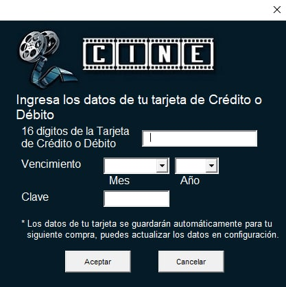

# CinemaApp 🎬 
The cinema application enables users to perform various actions, such as creating accounts, purchasing tickets, and checking the movie listings.  Additionally, the application offers administrative features, including managing movie listings and monitoring ticket sales.
This project was developed in August 2019. At that time, I had only covered basic concepts such as variables in class, along with implementing text printing in an Excel sheet upon button click. Despite not having undergone any formal programming course, I embarked on this project, lacking understanding of loops and functions. My approach was largely trial-and-error, supplemented by extensive research via online resources. Ultimately, though unsure of its inner workings, the project proved to be functional.

## Functionality and Specifications 🍿
* User Authentication: Includes account creation (ensuring uniqueness of usernames/emails, validating email format, password verification, security question), login (tracks failed login attempts), password change (verification required), password recovery (via security question), account deletion. Adults have the option to add debit/credit cards for payment. Users can view purchased tickets (pending, paid, used) and generate barcode for cinema entry.
* Administrator Authentication: Allows updating movie listings, accessing ticket sales summary with filters, viewing user list, modifying user details.
* Secret Manager Login: Grants access to password change for administration.
* Movie Listings: Displays movies along with availability dates and ticket purchase options.
* Ticket Purchase: Shows available branches, seats, prices, and timings (which vary during the week and for movie premieres). Payment can be made using registered cards or at the counter.
* Counter: Receives the user-generated ticket barcode and indicates one of three possibilities: unpaid ticket (prompting for payment), already paid ticket.
* Reader (at cinema entrance): Receives the user-generated ticket barcode and indicates one of four possibilities: unpaid ticket, ticket not valid for this branch, paid ticket (and marks it as used), already used ticket.

## Note 🥤
The .vb archive is not excecutable, it's just a placeholder to make GitHub recognize some code and set this project as coded in Visual Basic.
The original project (Cine.xlsm) was built entirely using Visual Basic For Excel, and thus it is a shortened version of language embedded into .xlms files, GitHub does not recognizes it.

**IMPORTANT:** Enable macros to run the program.

## Screenshots 🎥
### Click to open each aplication
 

### User mode: Sign in, sign up and terms
  

### User mode: Reset password (forgot my password)

### User mode: Main page

### User mode: Billboard and select tickets
 

### User mode: Payment method, CC data
 

### User mode: Barcode to pay, barcode to enter the cinema room
 

### User mode: Locations
   

### User mode: Configuration
 

### User mode: Require password to view and change sensitive info
 
 

### Administrator mode: Sign in and main page
 

### Administrator mode: Update billboard

### Administrator mode: View sales

### Administrator mode: Change user (when his account has tried to be stolen)

### Manager mode: Change administrator password

### Cash desk & Reader at cinema room entrance aplication
*Already implemented, pending screenshots*

## Future implementations 🎞️
I plan to resume this project soon, review the code, implement functions, and optimize it. I'll likely carry out the improvements using Java or Kotlin Multiplatform.
